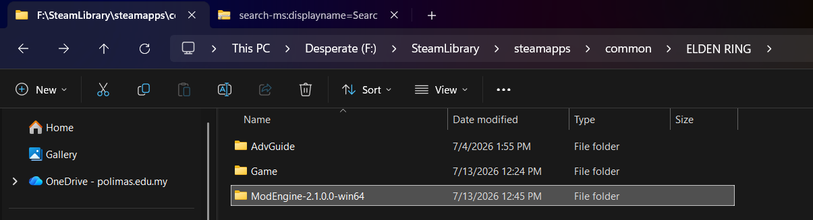
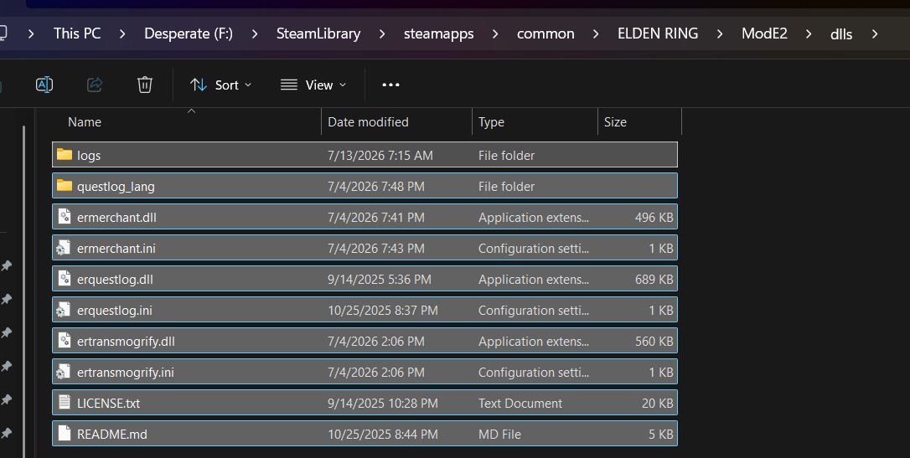
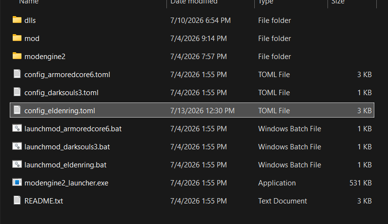
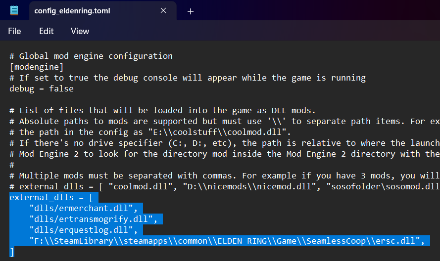
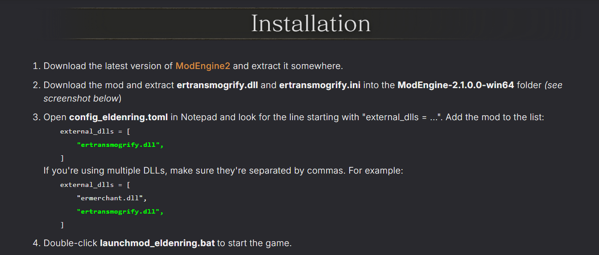
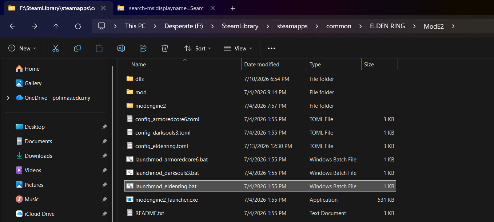

# ELDEN Ring Guide - 1245620

- Go to game installation folder
- Run as administrator `ersc_launcher.exe` inside the folder `ELDEN RING/Game`
**How to play with friends**
- Go through the prologue. (you need to get to the first place of grace and activate it) 
***Connection: Go to the inventory***
- Use the item Effigy of Malenia. You will be automatically connected to the host.
***Server creation:***
- Go to inventory. Use the Tiny Great Pot item. Waiting for friends to connect

# NOTES: 
DEFAULT CO-OP PASSWORD IS **suo_elden**

Update Seamless co-op to 1.9.9

Step by step on how to play Seamless Coop with Mods using mod engine 2
(DO NOT LAUNCH USING ERSC IF YOU WANT MOD, USE launchmod_eldenring.bat inside mod engine 2 folder):

1. Download mod engine 2: https://github.com/soulsmods/ModEngine2/releases/tag/release-2.1.0

2. Extract to any location,preferably, inside Elden Ring for Easier searching

3. Inside mods engine folder, create a folder called dlls

this will be the place we put any mods with dll extension

example of QOL mods:

Transmogrify Armor, Glorious merchant, Quest Log

4. Open the file called config_eldenring.toml

5. Edit the line external dlls line

the line depends on your location and mods installed,example:

external_dlls = [
    "dlls/ermerchant.dll",
    "dlls/ertransmogrify.dll",
    "dlls/erquestlog.dll",
    "F:\\SteamLibrary\\steamapps\\common\\ELDEN RING\\Game\\SeamlessCoop\\ersc.dll",
]

one line always stay for seamless coop which is
D:\\SteamLibrary\\steamapps\\common\\ELDEN RING\\Game\\SeamlessCoop\\ersc.dll",

if you install Elden Ring at C, it will be C,if D if will be D, and vice versa

most mods will also tell you how to install them

Last, run the bat file to launch the games with mods

