# How to Bypass Denuvo Games using Bypass Game button?

# Follow this guide
https://discord.com/channels/333191744873299978/1499122656686116944

## **Prequisites Guide**
Before Downloading game at steam make sure game **already lock version** at SUO 
```SUO > Tools > Game Auto Update > click open > find game``` 
by default is (🔒 Lock)
Disable=🔒 Lock
Enable=🔓Unlock

## **Bypass Hypervisor Guide**
1. Turn off Memory Intergrity in Core Isolation (by default it should be off)
2. Turn off Antivirus (real-time protection)
3. Download game** [GAMENAME]** from Steam
4. Click Bypass Game in Steam Unlock

## **Launch Option**
1. Open from Steam Unlock, click PLAY, choose exe and choose HV-PlugNPlay.bat/HV-Launcher.bat **(only work at Win 11)**
2. Run game from HV-PlugNPlay.bat /HV-Launcher.bat or  **[GAMENAME].exe**
3. Open game from steam but need run```SUO > Tools > inject HV launch Option```

1. Search Core Isolation at start menu

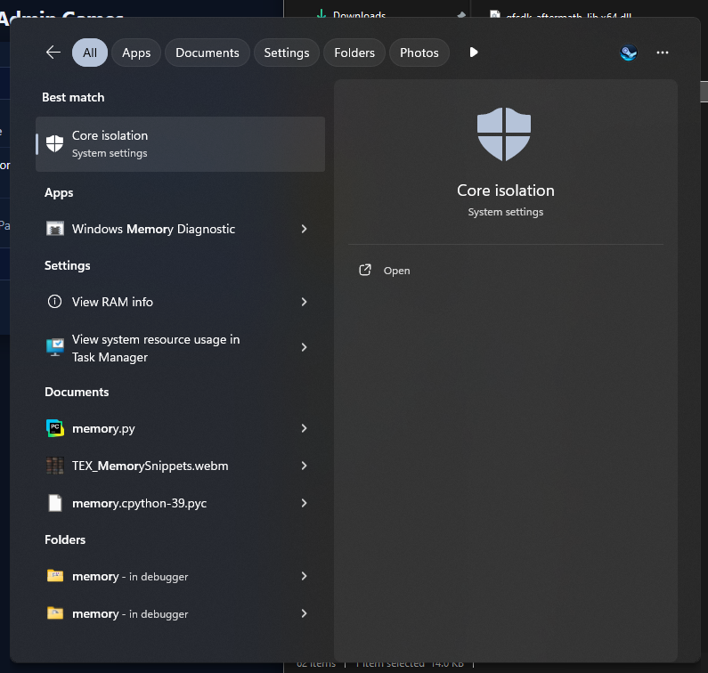

2. Turn off Memory Intergrity


3. Follow the tutorial for CloudRedirect
https://discordapp.com/channels/333191744873299978/1495014736515829760, IMPORTANT! USE MANIFEST PINNING AS SHOWN HERE, and then Restart Steam

NOTE: YOU DO THIS ONLY ONCE

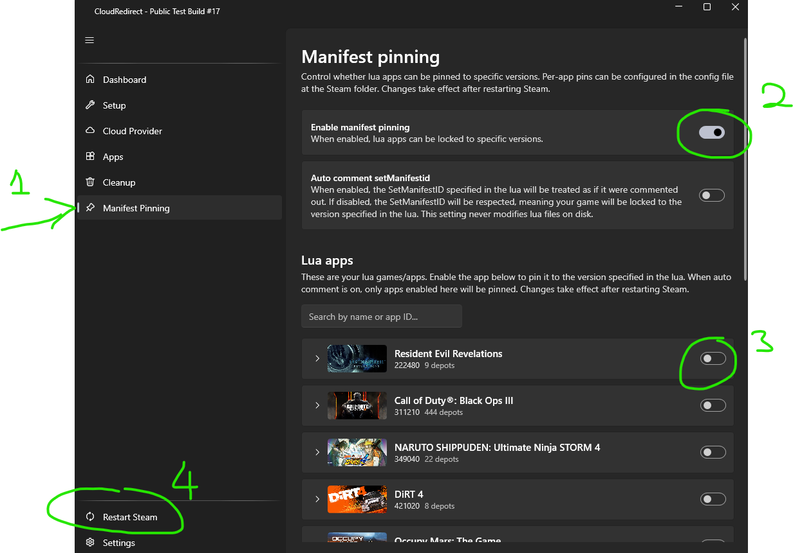

4. Download your denuv0 game in steam

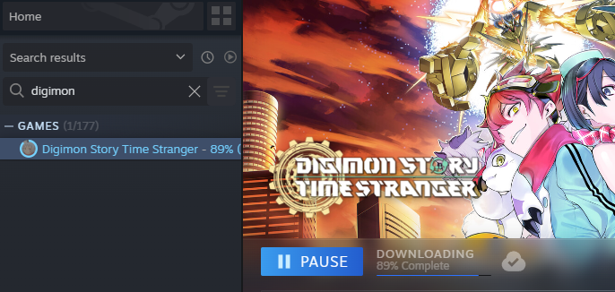

5. Once Finish Download, click Bypass Game

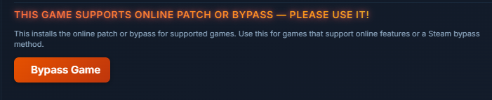

6. Once that is done, open the game from Steam Unlock, Click Play > Choose EXE

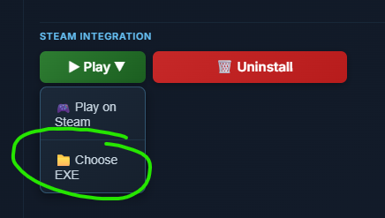

7. Try and Launch the game using .exe or .bat

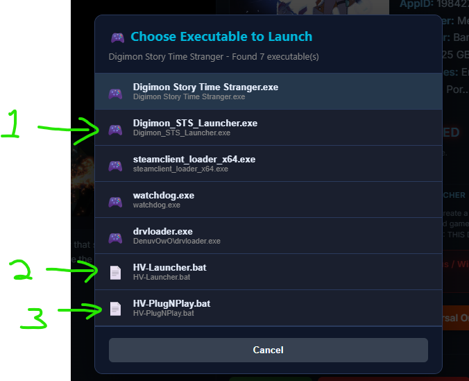

Choose 1

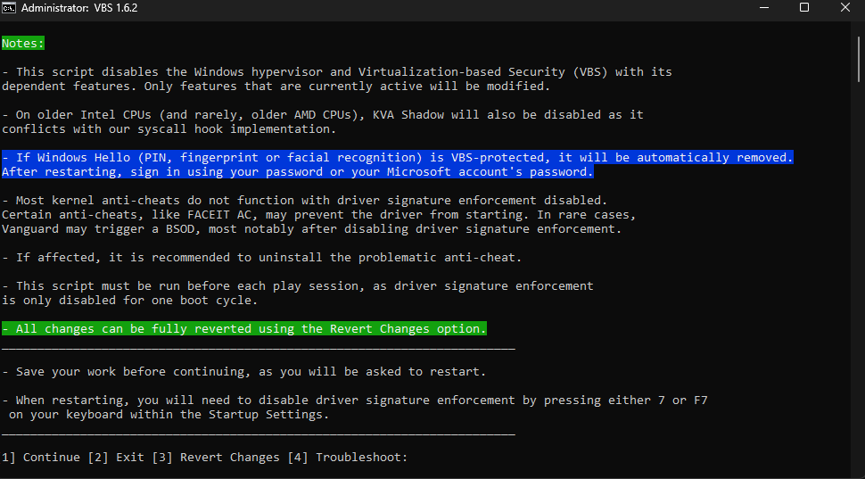

Choose 1 again to restart

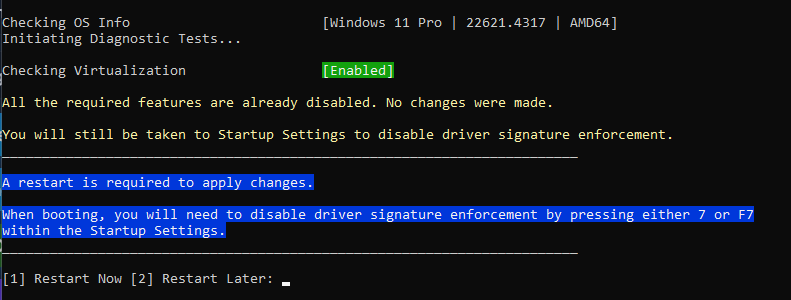

After PC restart, you maybe prompted with this screen, just PRESS F7

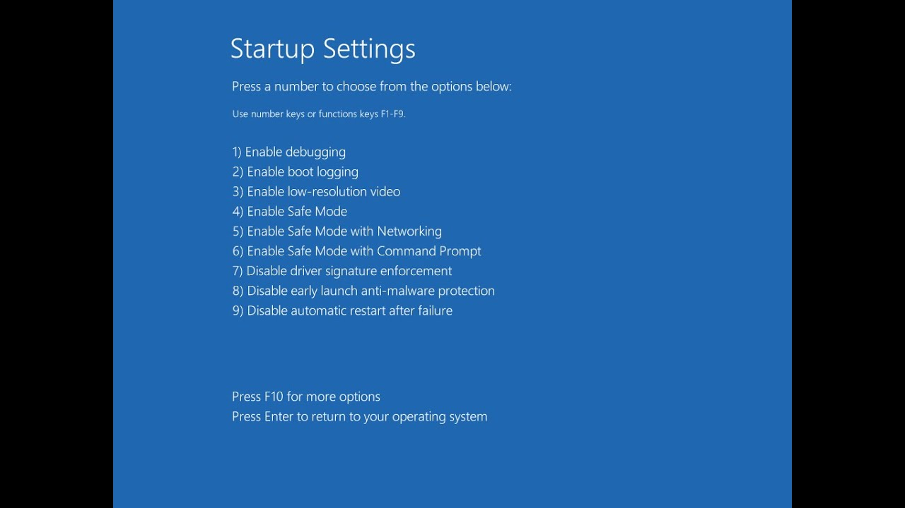

And then try Play your game again.

# THIS IS ONE TIME ONLY
If you encounter this error, please enable VT-x / SVM in your BIOS, follow the video below

1. for MSI https://www.youtube.com/watch?v=qKIcbKNI-g0
2. for GigaByte https://www.youtube.com/watch?v=fpHEbny3Mhs
3. for ASRock https://www.youtube.com/watch?v=p0QeY9tyAbI
4. for ASUS https://www.youtube.com/watch?v=bQDVvhtBeO4
5. for DELL https://www.youtube.com/watch?v=n-C1hz42Qxw
6. for Lenovo https://www.youtube.com/watch?v=EEDddQTq-QE

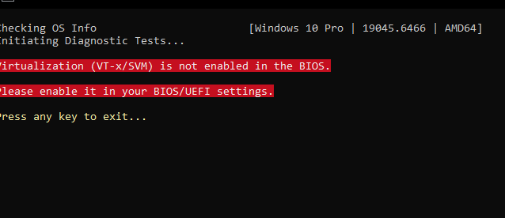

@Sugas ALL PLEASE READ SAMPAI HABIS, RUN VBS.CMD TO FIX ALL ERROR

1. ENABLE VIRTUALIZATION FROM BIOS IN YOUR PC ( 1 TIME ONLY)
2. TURN OFF CORE ISOLATION MEMORY INTERGRITY
3. RUN FROM HV-LAUNCHER OR HV-PLUGNPLAY

I SEE ALL NOT FINISH READING THIS TUTORIAL AT ALL AND ASSUME PLUG N PLAY ONLY

TO ENSURE YOUR VIRTUALIZATION SUCCESSFULLY TURNED ON, GO TO TASK MANAGER > PERFORMANCE , CHECK VIRTUALIZATION IS ENABLED OR NOT, IF NOT REPEAT ABOVE BIOS STEP.

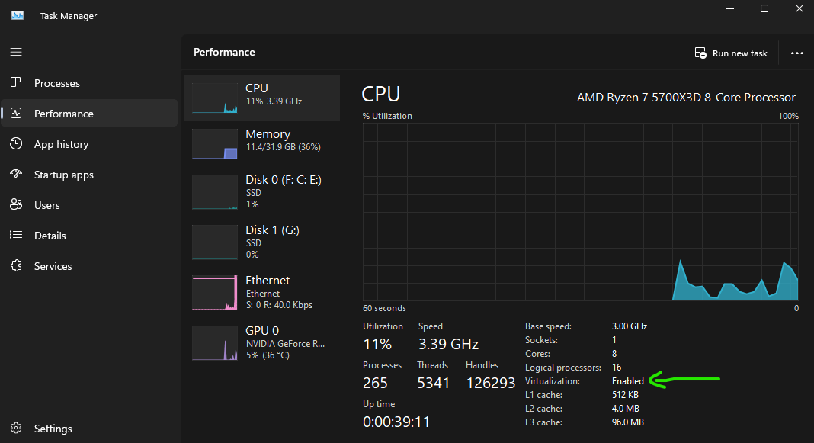

# HYPERVISOR ONLY WORK WITH CERTAIN GAME VERSION, THATS THE PURPOSE OF MANIFEST PINNING, DO NOT ASK FOR GAME UPDATE
-# PIRATE CAN'T BE CHOOSERS

# **!! IMPORTANT !!**
If you encounter this error. Download this file VBS.CMD version 1.7 and run it. 
# THIS IS ONE TIME ONLY

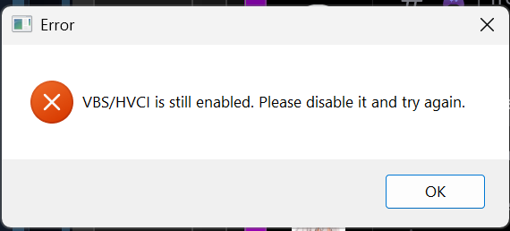


VBS changelog

> ## VBS Script 1.7
> 
> **Changelog:**
> 
> - Added detection for mapped network drives. Running the script from a mapped network drive, including shared folders in virtual machines that appear as mapped networks drives, is not supported and the script will now exit with an appropriate message instead of outright crashing. [This is a Windows issue and not the script's.](https://learn.microsoft.com/en-us/troubleshoot/windows-client/networking/mapped-drives-not-available-from-elevated-command)
> 
> - When a Windows Hello PIN is both enabled and protected by VBS on Windows 11, the script cannot continue and prompts the user to disable their PIN first. This further addresses Windows Hello related issues.
> - Added detection for Parallels Desktop for Mac. The script now checks BIOS and system manufacturer information to detect Parallels and exits with an appropriate message.
> - The script now checks if it’s running on an unsupported version of Windows (Windows 10, version 1909 or lower), and if so, prompts the user to update their Windows.
> - Fixed boot entry detection not working on Single Language editions of Windows by reading the value by position instead of searching for the word "identifier".
> - Fixed an issue where disabling VBS with Credential Guard enabled on Windows 10 could require two reboots before fully taking effect.
> - Added detection and disabling of additional registry keys for Enhanced Sign-in Security, covering keys that were previously missed.
> - Fixed an issue where Startup Settings wouldn't show up on boot in a system that has disabled advanced boot options.
> - The script now checks whether the Windows architecture is unsupported, and if so, prompts the user to exit.
> - Updated introductory notes.
> - Minor improvements.
> - Bug fixes.
> - We rely on user reports to identify and fix issues. If you encounter any problems, please report them at #deleted-channel.
> As a reminder, the "Run as administrator" option in the context menu will fail to execute the script on paths that contain certain special characters. **This is a Windows issue and not the script's.**
> We recommend that instructions avoid explicitly directing users to run the script with administrative privileges. Instead, users should launch the script normally and, if prompted, simply approve the UAC dialog to grant the necessary privileges.
> In order to fix this, open Command Prompt as administrator, then paste in and execute these commands:
> ```cmd
> set _r=^%SystemRoot^%
> reg add HKLM\SOFTWARE\Classes\batfile\shell\runas\command /f /v "" /t REG_EXPAND_SZ /d "%_r%\System32\cmd.exe /C \"\"%1\" %*\""
> reg add HKLM\SOFTWARE\Classes\cmdfile\shell\runas\command /f /v "" /t REG_EXPAND_SZ /d "%_r%\System32\cmd.exe /C \"\"%1\" %*\""
> ```
> From the documentation of KMS_VL_ALL:
> ||https://i.postimg.cc/K86VFcWy/image.png||
> 
> Special thanks to both [WindowsAddict](https://forums.mydigitallife.net/members/windows_addict.1668103/) and [abbodi1406](https://forums.mydigitallife.net/members/abbodi1406.204274/) for helping with this.

IF HAPPEN TO HAVE THIS ERROR DON'T PANIC AS WELL 

just follow this 

https://www.youtube.com/watch?v=Vzm2YQDcsfw

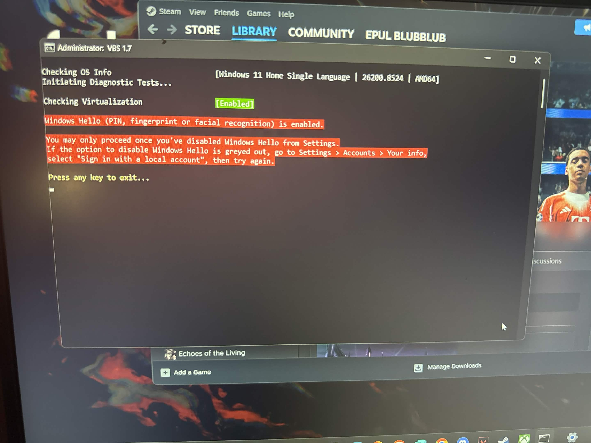

VBS CMD update 1.7.2

- Improved boot entry identifier detection, addressing issues for some dual boot systems.
- Added an error message for when the current boot entry could not be identified.
- Added detection and disabling of Hypervisor-Enforced Paging Translation.
- Updated introductory notes.
- Minor improvements.


**VBS Script 1.8**
**Changelog:**

- The script now enables Test Signing instead of taking the user to disable driver signature enforcement through the Startup Settings in cases where Secure Boot is off. This approach is more stable, and does not need to be reapplied after every restart. Learn more about Test Signing here.
- Improved Windows Hello detection.
- Updated introductory notes.
- Minor improvements.
- Bug fixes.

As a reminder, the "Run as administrator" option in the context menu will fail to execute the script on paths that contain certain special characters. This is a Windows issue and not the script's.

We recommend that instructions avoid explicitly directing users to run the script with administrative privileges. Instead, users should launch the script normally and, if prompted, simply approve the UAC dialog to grant the necessary privileges.

In order to fix this, open Command Prompt as administrator, then paste in and execute these commands:


**VBS 1.9**
**Changelog:**

• Added a check for Bitdefender Advanced Threat Defense. The script will now warn the user when Bitdefender Advanced Threat Defense is on, as it may cause an “Initialization error 5” message in certain games that use VMProtect, notably Ubisoft and Capcom titles.
• Added a check for MacType. The script will now warn the user when MacType is running as it’s known to cause games to silently crash. The script may also disable MacType when it’s set to run as a service.
• Updated introductory notes.
• Bug fixes


