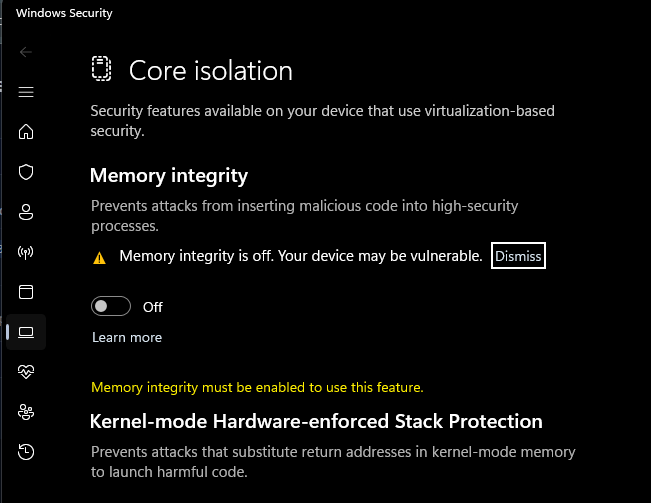
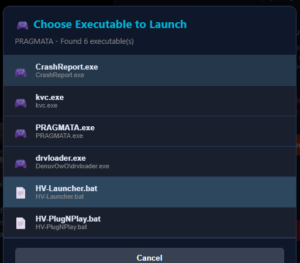
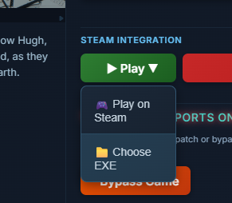

# Name: Sonic Racing: CrossWorlds - 2486820

# Follow this guide
https://discord.com/channels/333191744873299978/1499122656686116944

## **Prequisites Guide**
1. Before Downloading game, launch CloudRedirect from Tools section or download from 
https://github.com/Selectively11/CloudRedirect/releases/latest
2. Follow guide completely at #☁️︱cloudredirect-tutorial 
3. Manifest pinning via CloudRedirect.

## **Bypass Hypervisor Guide**
1. Turn off Memory Intergrity in Core Isolation (by default it should be off)
2. Turn off Antivirus (real-time protection)
3. Download game** [GAMENAME]** from Steam
4. Click Bypass Game in Steam Unlock

## **Launch Option**
1. Open from Steam Unlock, click PLAY, choose exe and choose HV-PlugNPlay.bat/HV-Launcher.bat **(only work at Win 11)**
2. Run game from HV-PlugNPlay.bat or HV-Launcher.bat or **[GAMENAME].exe**
3. Run from steam but need use this tools HVPNP.exe at #🔓︱onennabe-tips-and-tutorial




Run game from Steam Unlock as shown here, choose HV-Launcher.bat or HV-PlugNPlay.bat





## **Prequisites Guide**
**⚠️ Before** Downloading game at steam make sure game **already lock version** at SUO 
```SUO > Tools > Game Auto Update > click open > click Smart Apply``` 

## **Bypass Hypervisor Guide**
1. Find Core Isolation and Turn off Memory Intergrity (by default it should be off)
2. Turn off Antivirus (real-time protection) and Smart App Control (Win 11)
3. Check Virtualization Enable/Disable
**Ctrl + Shift + Esc** it will open ```Task manager > Performance > CPU > Virtualization: Enable```
*if not found that words mean is been disabled
4. Skip this if already enable. Else ,please enable VT-x / SVM in your BIOS (Search at Youtube your Motherboard brand)
5. Run ##VBS  / ##HV Tools (Run Script)  and Choose 1, after that Choose 1 again to restart pc
6. Press F7(driver Signature Enforcement)
7. Add Game From SUO
8. Download game** [GAMENAME]** from Steam
9. Click Hypervisor Bypass Game in SUO (SUO>Library>**[GAMENAME]**)

## **Launch Option**
1. Open from Steam Unlock, click PLAY, choose exe and choose HV-PlugNPlay.bat/HV-Launcher.bat **(only work at Win 11)**
2. Run game from HV-PlugNPlay.bat /HV-Launcher.bat or  **[GAMENAME].exe**
3. Open game from steam but need run```SUO > Tools > inject HV launch Option```

