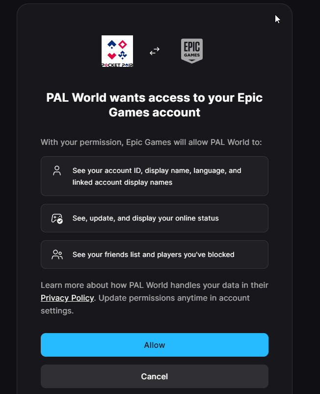
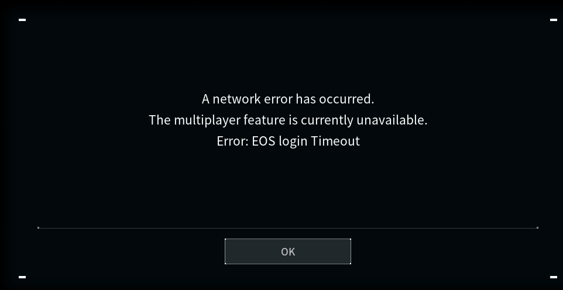

# Palworld  - 1623730

# BEFORE ANYTHING ELSE
1. Download EPIC Games Store at https://store.epicgames.com/
2. Register an account at https://www.epicgames.com/id/login?lang=en-US, login using Google also accepted.

# IN STEAM UNLOCK ONENNABE
1. Upon Unlocking game, it is advisable to go to Tools > Game Auto 
2. Update and click Smart Apply
Refer here: 
https://steamunlockonennabe.click/docs/updating-games/

Once Done, Install the game.

# First time & REPEAT THIS STEP
1. Open the game folder via Steam Unlock Onennabe https://steamunlockonennabe.click/docs/library-tab/#browse-local-files, go to 
```Pal\Binaries\Win64\FreeTP```
2. Delete **token.dat**
3. Start the game from Steam.
4. Web browser will automatically open and it will request to login to EPIC and allow Pocket Pairs to connect.
4. Ignore the Error: EOS Login Timeout, as it is waiting for the web browser to complete login.

# YOU HAVE TO DO THIS EVERYTIME STARTING THE GAME.





